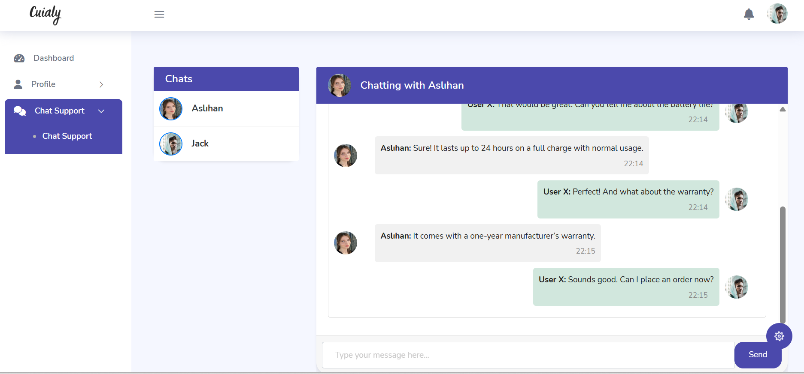

# Laravel & Pusher ile Gerçek Zamanlı Mesajlaşma Uygulaması

---

Bu proje, **Laravel** ve **Pusher** kullanarak **satıcı** ile **alıcı** arasında gerçek zamanlı mesajlaşma sağlayan bir uygulamadır.

## Özellikler

- 🔹 **Kullanıcı Rolleri:** Kayıt olurken **Satıcı** veya **Alıcı** rolü seçilir.
- 🔹 **Profil Yönetimi:** Sisteme giriş yaptıktan sonra kullanıcılar profillerini düzenleyebilir.
- 🔹 **Gerçek Zamanlı Mesajlaşma:** Satıcılar mevcut alıcılara anlık mesaj gönderebilir.
- 🔹 **Kesintisiz İletişim:** Laravel broadcasting ve Pusher altyapısı ile desteklenir.

---

**Teknolojiler:**

- Laravel Framework  
- Pusher (Real-time event broadcasting)  
- Blade Şablon Motoru  
- Bootstrap (arayüz tasarımı için)  

---

### .env dosyasını oluşturun ve aşağıdaki Pusher bilgilerini ekleyin:

`**BROADCAST_DRIVER=pusher**`
`PUSHER_APP_ID=your_pusher_app_id`
`PUSHER_APP_KEY=your_pusher_app_key`
`PUSHER_APP_SECRET=your_pusher_app_secret`
`PUSHER_APP_CLUSTER=your_pusher_cluster`

### Kurulum ve Çalıştırma
1. Depoyu klonlayın  
2. `composer install` komutunu çalıştırın  
3. `.env` dosyasını veritabanı ve Pusher bilgileriyle yapılandırın  
4. `php artisan migrate` ile veritabanı tablolarını oluşturun  
5. `php artisan serve` ile uygulamayı başlatın  

---

